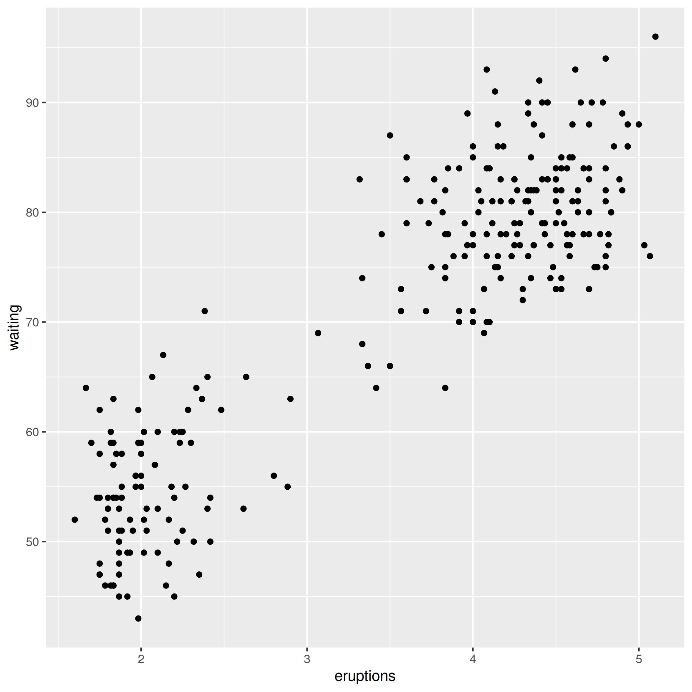
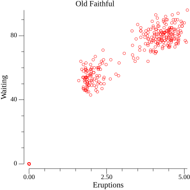

Clustering is an unsupervised learning algorithm to find and group similar things. I think the simplest clustering algorithm is the kmeans algorithm. It demonstrates how clustering works. Clustering can be [visualized](https://codesignal.com/learn/courses/k-means-decoded-1/lessons/visualizing-clusters-in-r) in R. I use the built-in dataset of the geysir [Old Faithful](https://en.wikipedia.org/wiki/Old_Faithful) which is available under a public domain licence to visualize clustering. If we plot the data we see there are two clusters:

The following [plot](https://github.com/gonum/plot) was made with gonum:

# K-Means Clustering

One of the fundamental disadvantages of the K-Means Clustering algorithm is that the number of clusters has to be specified in advance. In our simple example it can be deduced by visually inspecting the data that there are two clusters but for other data it might not be so obvious. There are methods to determine the ideal number of clusters like the [elbow method](https://en.wikipedia.org/wiki/Elbow_method_(clustering)).

The K-Means algorithm works by randomly placing centroids for the clusters and than assigning data points to the nearest centroid. After that the centroids are moved by calculating the mean of the data.
